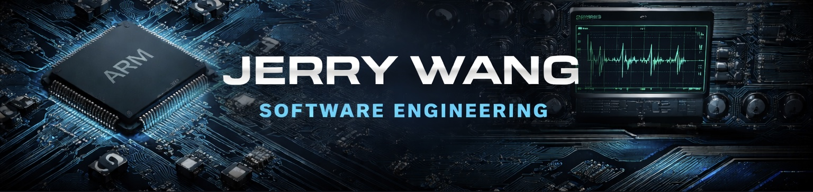

---

### Overview

I work on firmware bring-up and system-level debugging.

My focus is making hardware talk, making failures visible,
and making systems debuggable when they are not supposed to be.

---

### Scope

▸ ARM Cortex-M bring-up (bare-metal / RTOS)  
▸ BSP and driver integration  
▸ Low-level debug: JTAG / SWD / GDB / OpenOCD  
▸ Embedded Linux system bring-up  
▸ Firmware test automation  
▸ Log-driven failure analysis  

---

### Languages

---

### Systems & Tooling

---

### Contact

Email    : jerrywang1201@gmail.com  
LinkedIn : https://linkedin.com/in/jw1201
